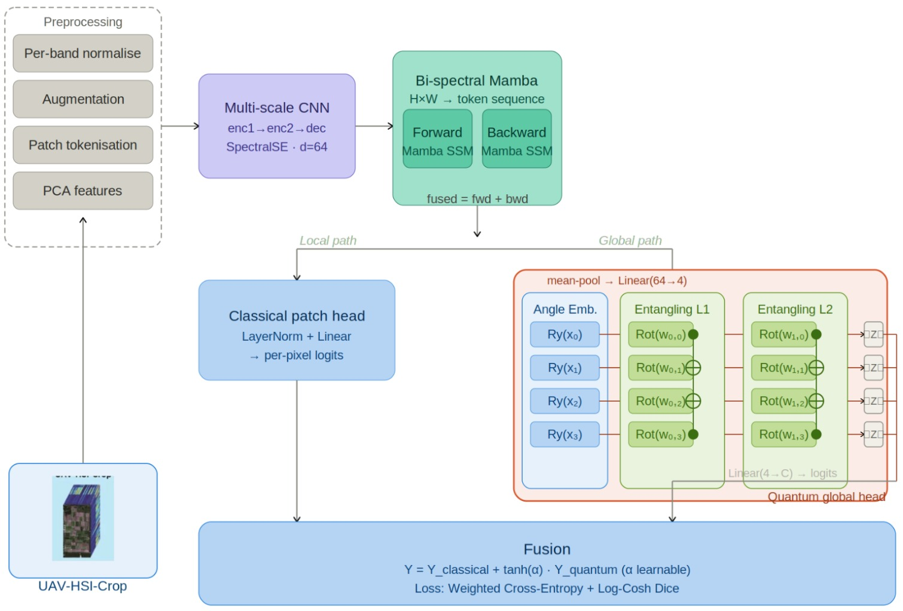
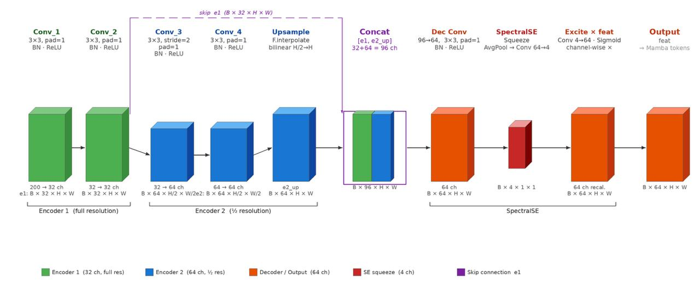
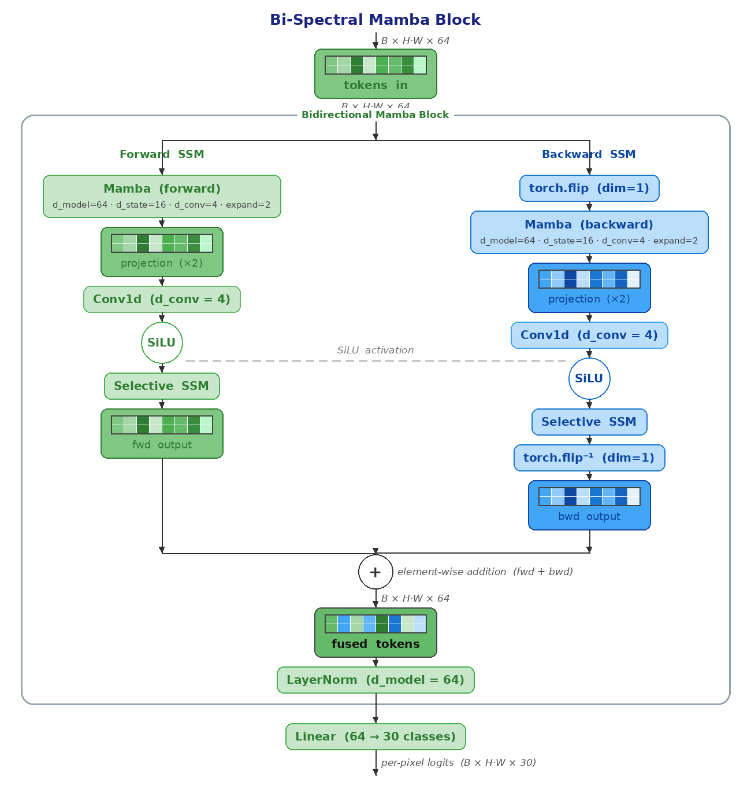

# Crop Disease Analysis through Hyperspectral Images Using Deep Learning Models


## Overview

This repository contains the full implementation of two novel hybrid quantum-classical deep learning architectures for crop disease analysis using UAV-acquired hyperspectral imagery. The work directly targets the computational and mathematical bottlenecks of classical deep learning — specifically unsustainable parameter counts, severe class imbalance, and the inability to efficiently model global spectral-spatial dependencies in high-dimensional agricultural data.

By replacing massive classical dense layers with a **parameterized 4-qubit variational quantum circuit**, both architectures deliver highly competitive classification accuracy at a dramatically reduced parameter footprint — proving that quantum mechanics can natively synthesize complex non-linear global dependencies required for precise crop field classification.

---

## Abstract

Modern precision agriculture increasingly relies on high-resolution UAV hyperspectral imagery to map diverse vegetation species and monitor complex crop health. This thesis engineers ultra-lightweight, parameter-efficient hybrid quantum-classical architectures to overcome the computational vulnerabilities of classical deep learning. Two novel frameworks are introduced:

1. **Quantum Patch-Graph Transformer (QPGF)** — Structures spatial patches into row-normalized 4-nearest neighbor graphs, fusing local graph attention with quantum global feature extraction.
2. **Quantum Enhanced CNN-BiSpectralMamba** — Leverages bidirectional Mamba state-space models to process continuous spectral sequences at linear complexity, fused with a multi-scale CNN backbone and a quantum global head.

Both architectures are stabilized by a custom **Hybrid Cross-Entropy + Log-Cosh Dice loss** that forces the network to penalize dominant staple crops and accurately map rare minority vegetation boundaries.

---

## Model 1 — Quantum Patch-Graph Transformer (QPGF)

### Architecture Overview


The QPGF framework classifies hyperspectral imagery by fusing graph-based spatial transformers with a variational quantum circuit.

**Pipeline:**
- Per-band min-max normalization
- Patch embedding via Conv2D projection (stride 6, D=192)
- 4-Nearest Neighbor graph construction with row-normalized adjacency matrix
- 6 sequential Graph Transformer blocks with masked multi-head attention
- Dual Classical + Quantum prediction heads
- Dynamic quantum fusion: `Ŷ = Ŷ_classical + α · Ŷ_quantum`

### Graph Transformer Block


Each block applies masked multi-head graph attention (4 heads, d_head=48) followed by a GELU feed-forward MLP with gated residual connections and instance normalization.

### Training Parameters (QPGF)

| Parameter | Value |
|---|---|
| Optimizer | AdamW |
| Classical LR | 3×10⁻⁴ |
| Quantum LR | 5×10⁻⁵ |
| Epochs | 100 |
| Weight Decay | 1×10⁻⁴ |
| Batch Size | 8 |
| Max Quantum Weight α | 0.2 |
| Quantum Warmup Epochs | 30 |

### Results (QPGF)

| Model | Epochs | OA (%) | Kappa (κ×100) |
|---|---|---|---|
| SegNet | 200 | 43.61 | 54.15 |
| SETR | 200 | 69.47 | 72.67 |
| UNet | 200 | 76.07 | 71.31 |
| TransUNet | 200 | 78.64 | 74.56 |
| HSI-TransUNet | 200 | 86.05 | 83.47 |
| HRS-UNet | 200 | 89.96 | 88.14 |
| **QPGF (Ours)** | **100** | **81.92** | **78.41** |

QPGF achieves competitive segmentation quality (~4.16M parameters, ~16.6 MB) in **half the training epochs** of all baselines.

---

## Model 2 — Quantum Enhanced CNN-BiSpectralMamba

### Architecture Overview



This architecture fuses multi-scale spatial convolutions, bidirectional state-space sequence modeling, and a variational quantum circuit into a single, highly efficient pipeline.

### Multi-Scale CNN



The CNN backbone uses two encoder blocks and a decoder with skip connections:
- **Encoder 1** — Two 3×3 Conv + BN + ReLU → 32-channel feature map E₁ (full resolution)
- **Encoder 2** — Strided Conv (stride=2) + Conv → 64-channel feature map E₂ (½ resolution)
- **Decoder** — Bilinear upsample E₂ → concat with E₁ → final Conv → F_dec
- **SpectralSE** — Adaptive AvgPool → FC → Sigmoid channel-wise recalibration

### Bi-Spectral Mamba Block



The spatial feature map is flattened into a 1D token sequence (L = H×W) and processed through two independent Mamba SSM blocks:
- **Forward SSM** — Processes sequence in native spatial order
- **Backward SSM** — Processes a flipped sequence, then un-flips output
- **Fusion** — Element-wise addition: `H_fused = H_forward + H_backward`

### Quantum Global Head

The global feature token (mean-pooled from H_fused) is reduced to 4 dimensions and fed into a **4-qubit parameterized quantum circuit** using:
- Angle Embedding (Rx gates)
- 2 Basic Entangler Layers
- Pauli-Z expectation value readout

Final fusion: `Y_logits = Y_classical + tanh(α) · Y_quantum`

### Training Parameters (CNN-BiSpectralMamba)

| Parameter | Value |
|---|---|
| Optimizer | AdamW |
| Classical Backbone LR | 3×10⁻⁴ |
| Quantum Head LR | 5×10⁻⁵ |
| Epochs | 100 |
| Weight Decay | 1×10⁻⁴ |
| Batch Size | 8 |
| Feature Dimension (d_model) | 64 |
| SE Reduction Ratio | 16 |
| Initial Quantum Weight α | 0.0 (Learnable) |
| Loss Weight λ | 0.5 |
| Class Frequency Power Scaling | 0.7 |

### Results (CNN-BiSpectralMamba)

| Model | Epochs | OA (%) | Kappa (κ×100) |
|---|---|---|---|
| SegNet | 200 | 43.61 | 54.15 |
| SETR | 200 | 69.47 | 72.67 |
| UNet | 200 | 76.07 | 71.31 |
| TransUNet | 200 | 78.64 | 74.56 |
| HSI-TransUNet | 200 | 86.05 | 83.47 |
| HRS-UNet | 200 | 89.96 | 88.14 |
| QPGF (Ours) | 100 | 81.92 | 78.41 |
| **CNN-BiSpectralMamba (Ours)** | **100** | **84.83** | **82.07** |

The CNN-BiSpectralMamba decisively outperforms TransUNet and our own QPGF baseline by ~3% OA, in **half the training epochs** of all classical baselines.

---

## Loss Function

Both models use a custom **Hybrid Cross-Entropy + Log-Cosh Dice Loss**:

**Class-Weighted Cross-Entropy:**

```
W_c = 1 / (sqrt(N_c) + 1e-6)^0.7
L_CE = -Σ W_i · y_i · log(ŷ_i)
```

**Log-Cosh Dice Loss:**

```
L_DICE = 1 - (2·Σ(P·Y_onehot) + ε) / (ΣP + ΣY_onehot + ε)
L_LCD  = log(cosh(L_DICE))
```

**Total Loss:**

```
L_total = (1 - λ) · L_CE + λ · L_LCD      [λ = 0.5]
```

This dual formulation balances per-pixel classification accuracy with strict topological boundary mapping, directly combating the brutal class imbalance of real-world agricultural datasets.

---

## Dataset — UAV-HSI-Crop

| Property | Value |
|---|---|
| Total Samples | 433 |
| Spatial Size per Sample | 96 × 96 pixels |
| Spectral Bands | 200 |
| Wavelength Range | 400–1000 nm |
| Spatial Resolution | ~0.1 m/pixel |
| Number of Classes | 30 |
| Sensor | Resonon Pika-L |

The dataset was captured over agricultural fields in Majiakou Village and Xijingmeng Village, Shenzhou City, Hebei Province, China. It features **severe class imbalance** — dominant staple crops flood pixel counts while rare vegetation types barely register — making it a rigorous and realistic benchmark.

Classes include: Chinese cabbage, Millet, Leaf mustard, Green bean, Spinach, Bok Choy, Turnip, Cotton, Corn, Carrot, Sorghum, Pumpkin, Kohlrabi, Scallion, Sweet potato, Peanut, Sesame, Beans, Road, Tobacco, Holly, Cauliflower, Eggplant, Daikon, Sichuan peppercorn, Mulched field, Tree, Okra, Bare soil & Weed, and NULL.

---

## Project Structure

```
├── Dataset/
│   ├── Train/
│   │   ├── Training/
│   │   │   ├── rs/       ← hyperspectral patches (.npy)
│   │   │   └── gt/       ← ground truth labels (.npy)
│   │   └── Validation/
│   │       ├── rs/
│   │       └── gt/
│   └── Test/
│       ├── rs/
│       └── gt/
├── Quantum_Enhanced_MultiScale_CNN_with_BiSpectral_Mamba.ipynb
├── QPGF.ipynb
├── arch_graphtransformer.png
├── Mamba_Methodology.jpeg
├── methodology_qpgf.png
├── MULTI-SCALE_CNN.jpeg
├── bispectral_mamba.png
└── README.md
```

---

## Requirements

```bash
pip install torch torchvision pennylane mamba-ssm scikit-learn matplotlib seaborn tqdm numpy
```

**Hardware used for training:**
- Compute Canada NiBi Cluster
- 5× NVIDIA H100 GPUs
- 1 TB system memory
- 25 dedicated CPU cores
- Quantum circuit layers pinned to CPU (PennyLane simulation)

---

## How to Run

**1. Clone the repository:**
```bash
git clone https://github.com/khansalman19081206/Crop-Disease-Analysis-through-Hyperspectral-Images-Using-Deep-Learning-Models.git
cd Crop-Disease-Analysis-through-Hyperspectral-Images-Using-Deep-Learning-Models
```

**2. Set your dataset paths** inside the notebook (Block 8 / Setup cell):
```python
root_train = "/path/to/your/Train"
root_test  = "/path/to/your/Test"
```

**3. Run the notebooks in order:**
- `QPGF.ipynb` — Quantum Patch-Graph Transformer
- `Quantum_Enhanced_MultiScale_CNN_with_BiSpectral_Mamba.ipynb` — CNN-BiSpectralMamba model

---

## Ablation Studies

### QPGF Ablation

| Variant | OA (%) | Kappa (κ×100) |
|---|---|---|
| QPGF-a (CE only, no balancing) | 72.28 | 66.54 |
| QPGF-b (+ class weighting + balancing) | 81.48 | 77.98 |
| QPGF-c (no class weighting) | 80.62 | 77.28 |
| QPGF-d (reduced β=0.3) | 78.16 | 74.57 |

### CNN-BiSpectralMamba Ablation

| Variant | OA (%) | Kappa (κ×100) |
|---|---|---|
| No Quantum (Ablation 1) | 83.51 | 80.65 |
| No BiMamba (Ablation 2) | 79.50 | 75.59 |
| Plain CE Loss (Ablation 3) | 85.24 | 82.64 |
| No SE Block (Ablation 4) | 84.37 | 81.56 |
| **Proposed (Full Model)** | **84.83** | **82.07** |

The drop in Ablation 2 (−5.33% OA) confirms that bidirectional Mamba is the core of the architecture. The quantum head contributes +1.32% OA over the no-quantum baseline.

> **Note on Ablation 3:** Plain CE achieves 85.24% OA by inflating the pixel-counting metric through dominant class over-optimization. The proposed hybrid loss willingly sacrifices 0.41% of skewed global accuracy to guarantee equitable, structurally robust mapping of all minority crop classes.

---

Supervised by:Dr. Saad Bin Ahmed, Assistant Professor, Department of Computer Science, Lakehead University  
Contact:sbinahm@lakeheadu.ca

---

## Acknowledgements

This research was supported by the computing resources provided by **Compute Canada (NiBi cluster)** and the facilities of **Lakehead University**. Special thanks to Dr. Saad Bin Ahmed for his guidance and supervision throughout this work.

---

## License

© Copyright 2026 by Mohammed Salman Khan — Lakehead University, Thunder Bay, ON, Canada.
